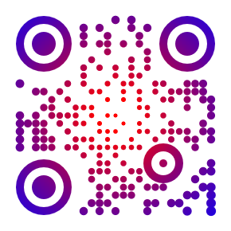
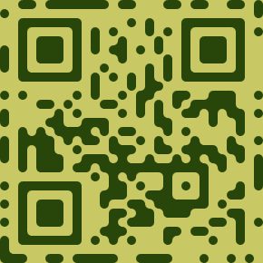

# qrframe

framework for making qr codes

Blatantly inspired by [QRBTF](https://qrbtf.com) and [Anthony Fu's QR Toolkit](https://qrcode.antfu.me).

## Features

- Customize data:
  - encoding mode, version, error tolerance, mask pattern
  - powered by [`fuqr`](https://github.com/zhengkyl/fuqr), my own Rust library imported as WASM. (i use windows, btw)

- Customize appearance:
  - Choose any preset, customize or even create a new one from scratch via code editor.
  - Define arbitrary ui parameters in code
  - Supports SVG and PNG (canvas)
  - No safeguards whatsoever. All code runs directly in browser. This is a hammer, not a toy for babies 🤡.

## Use existing presets

## Customizable parameters defined in code

## Examples

I'm working on more examples.

<table>
  <thead>
    <tr>
      <th colspan="3">Basic styles</th>
    </tr>
  </thead>
  <tbody>
  <tr>
    <td>
      
    </td>
    <td>
      
    </td>
    <td>
      
    </td>
  </tr>
  </tbody>
</table>

<table>
  <thead>
    <tr>
      <th colspan="3">Implementing styles from <a href="https://qrbtf.com" target="_blank">QRBTF</a></th>
    </tr>
  </thead>
  <tbody>
  <tr>
    <td>
      
    </td>
    <td>
      
    </td>
    <td>
      
    </td>
  </tr>
  </tbody>
</table>
