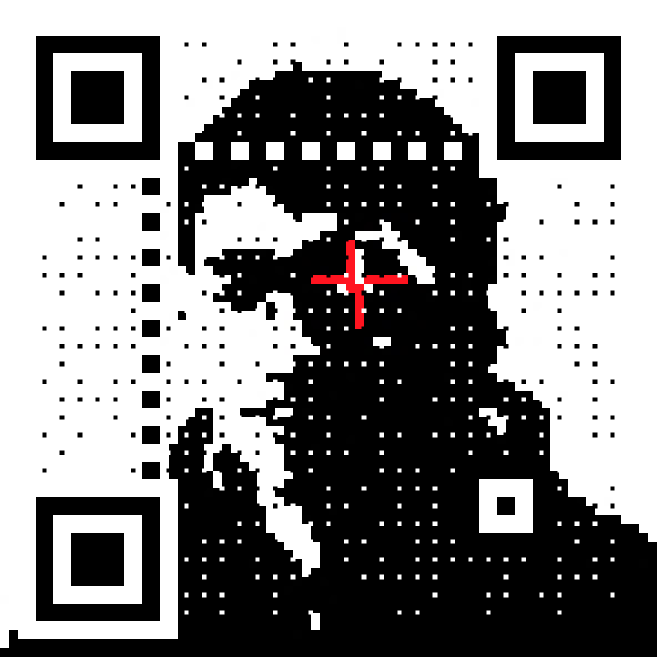

# QR Framework

The QR code generation is powerd by [`fuqr`](https://github.com/zhengkyl/fuqr), my own Rust library imported as WASM.

## Prior work

Blatantly inspired by [Anthony Fu's QR Toolkit](https://qrcode.antfu.me).

I'm using [`solid-start`](https://start.solidjs.com), [`kobalte`](https://kobalte.dev) components, and [`unocss`](https://unocss.dev/) for styling.

