# qrframe

code-based qr code generator

Blatantly inspired by [QRBTF](https://qrbtf.com) and [Anthony Fu's QR Toolkit](https://qrcode.antfu.me).

[Here's a post I wrote about crafting QR codes](https://kylezhe.ng/posts/crafting_qr_codes) that goes into deeper detail about how they work and ways to make them pretty.

## Examples

> [!CAUTION]
> These example QR codes may not be reliably scannable! Results may vary drastically based on device and scanner!

This project is a tool to create designs! These are only examples!

<table>
  <tbody>
    <tr>
      <th colspan="3">Creative possibilities</th>
    </tr>
    <tr>
      <td>
        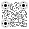
      </td>
      <td>
        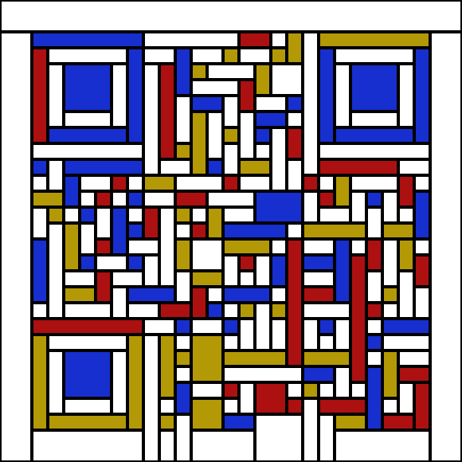
      </td>
      <td>
        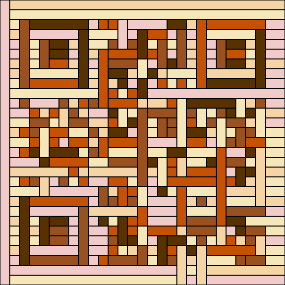
      </td>
    </tr>
    <tr>
      <td>
        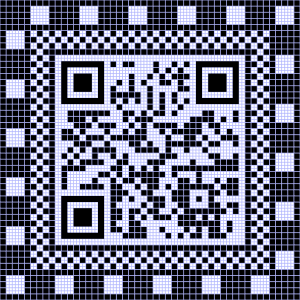
      </td>
      <td>
        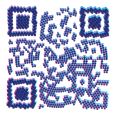
      </td>
      <td>
        
      </td>
    </tr>
    <tr>
      <td>
        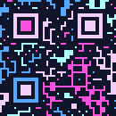
      </td>
      <td>
        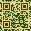
      </td>
      <td>
        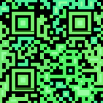
      </td>
    </tr>
    <tr>
      <td>
        
      </td>
      <td>
        
      </td>
      <td>
        
      </td>
    </tr>
    <tr>
      <th colspan="3">Import external libs, fetch external files, etc </th>
    </tr>
    <td>
      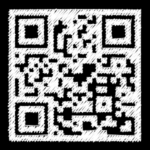
    </td>
    <td>
      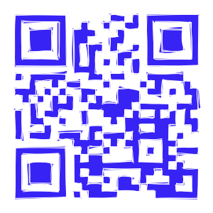
    </td>
      <td>
        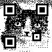
      </td>
    <tr>
      <th colspan="3">Styles copied from <a href="https://qrbtf.com">QRBTF</a></th>
    </tr>
    <tr>
      <td>
        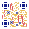
      </td>
      <td>
        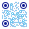
      </td>
      <td>
        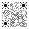
      </td>
    <tr>
      <th colspan="3">Boring options are available</th>
    </tr>
    <tr>
      <td>
        
      </td>
      <td>
        
      </td>
      <td>
        
      </td>
    </tr>

  </tbody>
</table>

## Create/modify designs with code

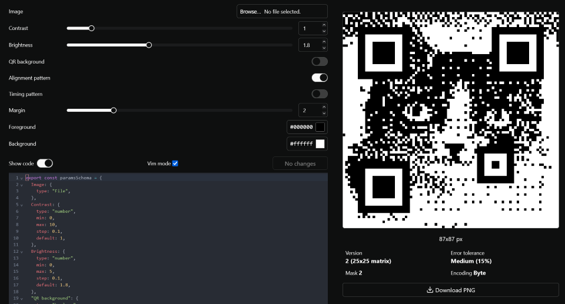

## Features

- Customize data:

  - encoding mode, version, error tolerance, mask pattern
  - powered by [`fuqr`](https://github.com/zhengkyl/fuqr), my own Rust library imported as WASM. (i use windows, btw)

- Customize appearance:
  - Choose any preset, customize or even create a new one from scratch via code editor.
  - Define arbitrary UI parameters in code
  - Supports SVG and PNG
  - All code runs _directly_ in browser in a web worker with no restrictions.
    - There is no sandbox, whitelist, blacklist, or anything besides a 5s timeout to stop infinite loops.
    - Generated SVGs are not sanitized. This is an impossible task and attempting it breaks perfectly fine SVGs, makes debugging harder, and adds latency to previewing changes.
    - These should be non-issues, but even if you copy-and-paste and run malware there's no secrets to leak.


## Creating a preset

A preset must export `paramsSchema` and either `renderSVG` or `renderCanvas`

## `paramsSchema`

This schema defines the UI components whose values are passed into `renderSVG` or `renderCanvas` via the `params` object.

All properties besides `type` are optional, except

- type `select` must have a nonempty options array
- type `array` must have a valid `props` value.

In this example, `default` is set explicitly to the implicit default value.

```js
export const paramsSchema = {
  Example1: {
    type: "number",
    min: 0,
    max: 10,
    step: 0.1,
    default: 0,
  },
  Example2: {
    type: "boolean",
    default: false,
  },
  Example3: {
    type: "color",
    default: "#000000", // css color string (hex/rgba/hsla)
  },
  Example4: {
    type: "select",
    options: ["I'm feeling", 22],
    default: "I'm feeling", // first option
  },
  Example5: {
    type: "file",
    accept: ".jpeg, .jpg, .png",
    default: null,
  },
  Example6: {
    type: "array",
    props: {
      type: "number", // any type except "array"
      // corresponding props
    },
    resizable: true,
    defaultLength: 5, // overridden by default
    default: [], // overrides defaultLength
  },
};
```

## `renderSVG` and `renderCanvas`

```ts
type renderSVG = (qr: Qr, params: Params) => string;

type renderCanvas = (qr: Qr, params: Params, canvas: OffscreenCanvas) => void;
```

`params` is an object with all the keys of `paramsSchema` paired with the value from their respective input component.

`qr` contains the final QR code in `matrix`. This represents a square where one side is `version * 4 + 17` wide, and modules (aka pixels) are stored from the left to right, top to bottom.

```ts
type Qr = {
  matrix: Uint8Array; // see below
  version: number; // 1- 40
  mask: number; // 0 - 7,
  ecl: number; // 0 - 3, Low, Medium, Quartile, High
  mode: number; // 0 - 2, Numeric, Alphanumeric, Byte
};

// bit flags for each u8 in matrix
const Module = {
  ON: 1 << 0,
  DATA: 1 << 1,
  FINDER: 1 << 2,
  ALIGNMENT: 1 << 3,
  TIMING: 1 << 4,
  FORMAT: 1 << 5,
  VERSION: 1 << 6,
  MODIFIER: 1 << 7,
};
```

`MODIFIER` is set for Finder and Alignment centers, Format and Version copy.
