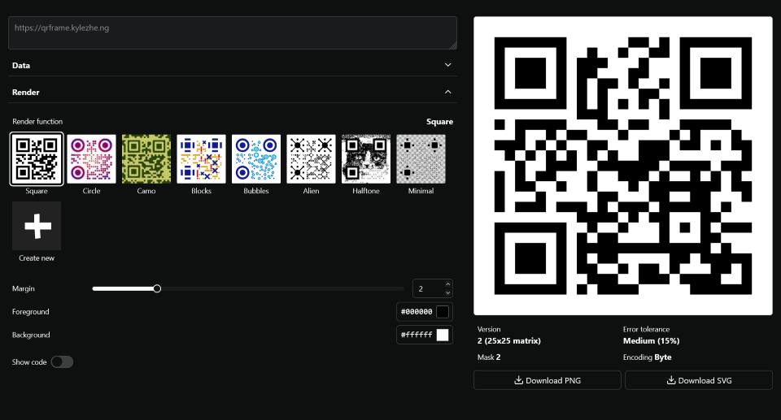

# qrframe

framework for making qr codes

Blatantly inspired by [QRBTF](https://qrbtf.com) and [Anthony Fu's QR Toolkit](https://qrcode.antfu.me).

## Examples

I'm working on more examples.

<table>
  <tbody>
    <tr>
      <th colspan="3">Creative possibilities</th>
    </tr>
    <tr>
      <td>
        
      </td>
      <td>
        
      </td>
      <td>
        
      </td>
    </tr>
    <td>
      
    </td>
    <td>
      
    </td>
    <tr>
    </tr>
    <tr>
      <th colspan="3">Extending with noise</th>
    </tr>
    <tr>
      <td>
        
      </td>
      <td>
        
      </td>
      <td>
        
      </td>
    </tr>
    <tr>
      <th colspan="3">Import external libs, fetch external files, etc </th>
    </tr>
    <td>
      
    </td>
    <td>
      
    </td>
      <td>
        
      </td>
    <tr>
      <th colspan="3">Styles copied from <a href="https://qrbtf.com">QRBTF</a></th>
    </tr>
    <tr>
      <td>
        
      </td>
      <td>
        
      </td>
      <td>
        
      </td>
    </tr>

  </tbody>
</table>

## Features

- Customize data:

  - encoding mode, version, error tolerance, mask pattern
  - powered by [`fuqr`](https://github.com/zhengkyl/fuqr), my own Rust library imported as WASM. (i use windows, btw)

- Customize appearance:
  - Choose any preset, customize or even create a new one from scratch via code editor.
  - Define arbitrary ui parameters in code
  - Supports SVG (string) and PNG (canvas)
  - All code runs _directly_ in browser in a web worker with no restrictions.

## Use existing presets

## Customizable parameters defined in code

