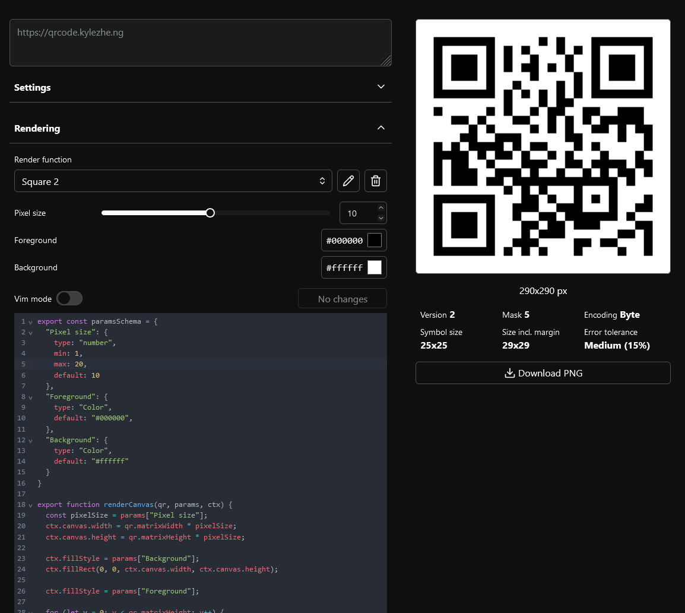

# QR Framework

Here's what you can do

- directly edit render function
- define ui for parameters in code
- make sick QR codes whether you have an anime pfp or skibidi toilet rizz

Blatantly inspired by [QRBTF](https://qrbtf.com) and [Anthony Fu's QR Toolkit](https://qrcode.antfu.me).

The QR code information is generated by [`fuqr`](https://github.com/zhengkyl/fuqr), my own Rust library imported as WASM. (i use windows, btw)

## Examples

I'm working on better examples.

| Circle                           | Camouflage                   | Lover                          |
| -------------------------------- | ---------------------------- | ------------------------------ |
|  |  |  |
